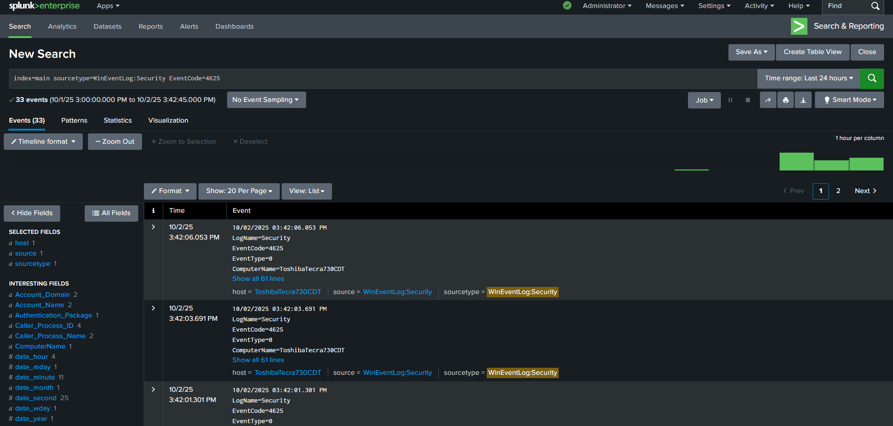
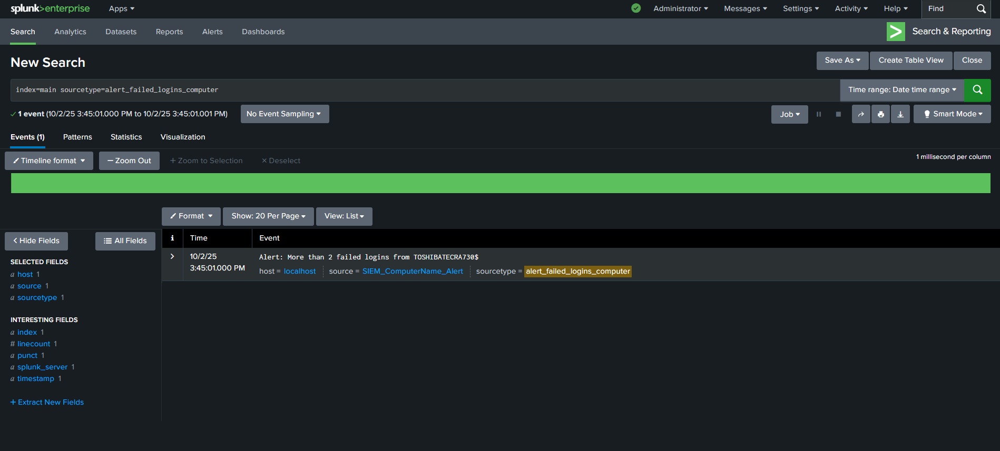
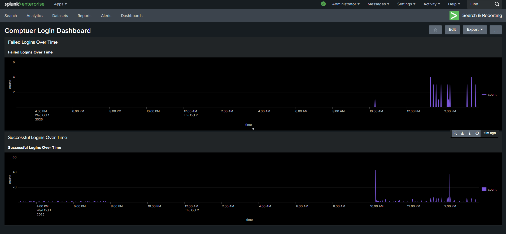

# Single-Computer Splunk SIEM Project

## Project Overview
This project demonstrates a SIEM setup using Splunk to monitor Windows login events for a single computer account (`TOSHIBATECRA730$`). Failed and successful logins are tracked, visualized on dashboards, and alerts are triggered when failed logins exceed 2 within 5 minutes.

## Data Source
- Windows Event Logs (Security)
- Event Codes:
  - 4624: Successful Logon
  - 4625: Failed Logon

## Splunk Queries

**Failed Logins**
index=main sourcetype=WinEventLog:Security EventCode=4625 Account_Name="TOSHIBATECRA730$"
| stats count as failed_logins
| where failed_logins > 2

**Successful Logins**
index=main sourcetype=WinEventLog:Security EventCode=4624 Account_Name="TOSHIBATECRA730$"
| timechart span=1m count

**Alerts Logged**
index=main sourcetype=alert_failed_logins_computer
| table _time, Event

## Dashboard
The dashboard includes:
- Failed Logins Over Time (line chart)
- Successful Logins Over Time (line chart)

### Screenshots
Add your images to the `screenshots/` folder and reference them here:

## Alert Setup
- **Search Query:** Counts failed logins > 2 from `TOSHIBATECRA730$`  
- **Alert Type:** Scheduled  
- **Cron Schedule:** `*/5 * * * *` (runs every 5 minutes)  
- **Time Range:** Last 5 minutes  
- **Trigger Alert When:** Number of Results > 0  
- **Trigger Alert Frequency:** Once (or repeat every 5 minutes if desired)  
- **Action:** Log Event to index `main` with sourcetype `alert_failed_logins_computer`  

